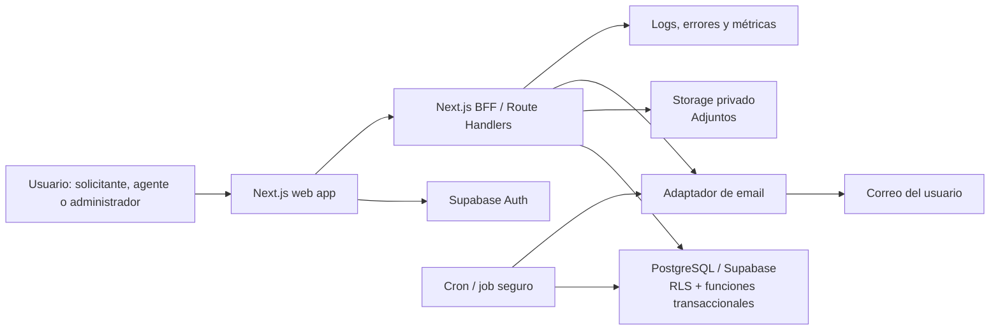
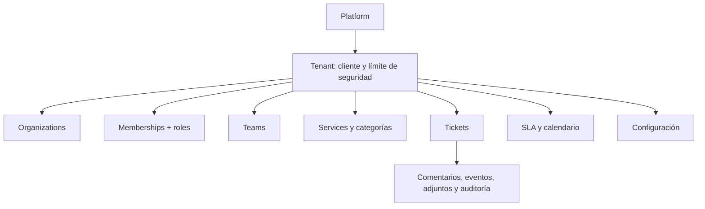
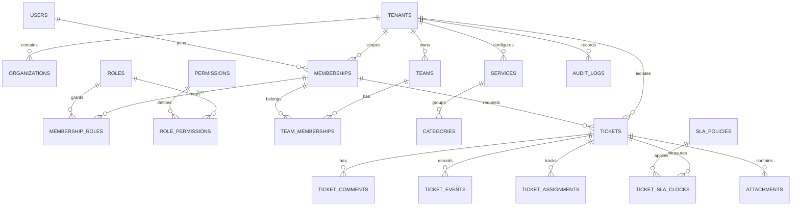
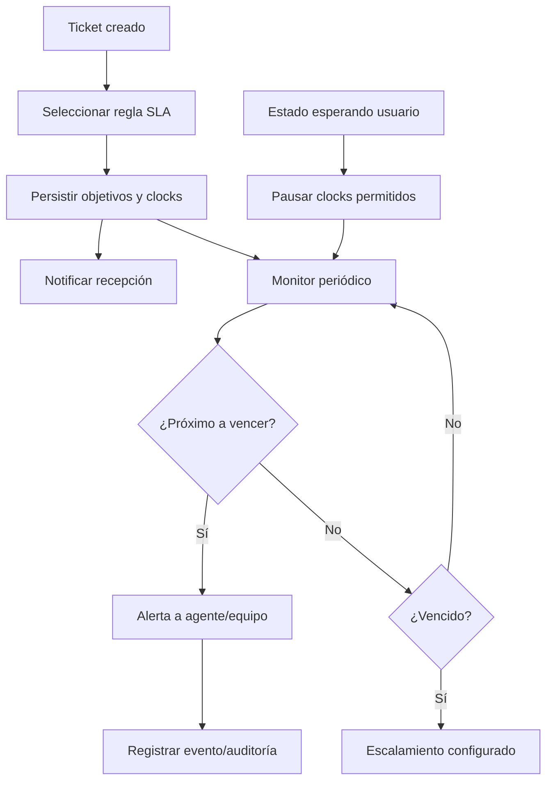
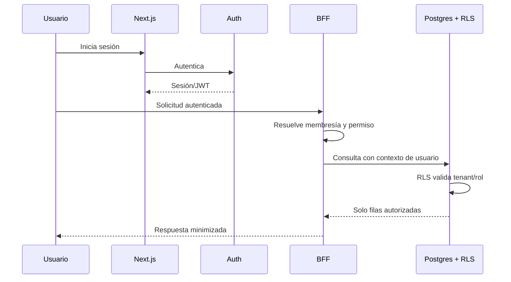
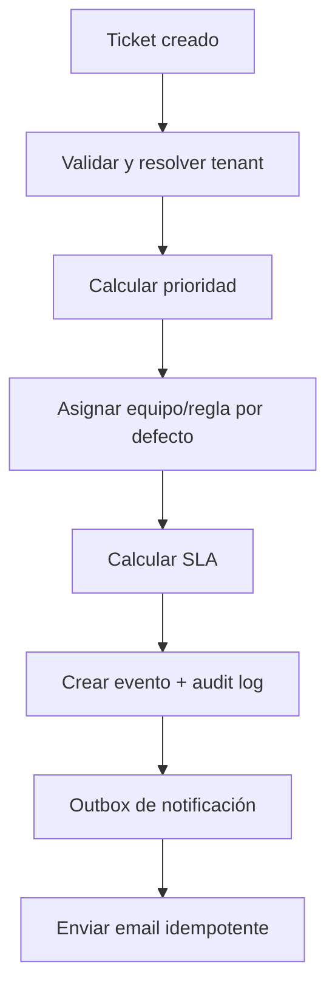
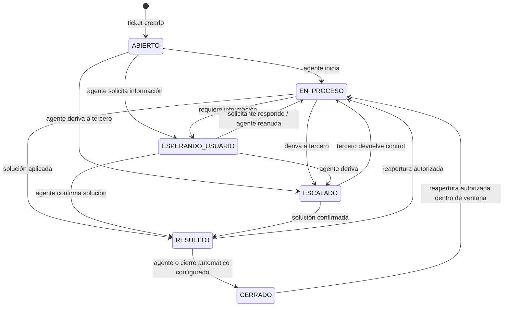

> **SOURCE OF TRUTH — DESKWORK**

# Especificación técnica canónica

Versión: 1.1  
Fecha: 2026-08-18  
Estado: revisión arquitectónica previa a Fase 3; **no se ha implementado software a partir de este documento**.

Esta especificación consolida `DESKWORK_PROJECT_MEMORY.md`, `DESKWORK_TECHNICAL_AUDIT.md`, el Documento Maestro, el manual de marca, la propuesta y los mockups. Ante conflicto, prevalece una decisión explícita posterior del usuario; después, el Documento Maestro. El mockup es referencia visual y nunca evidencia de una capacidad implementada.

### Convenciones de decisión

- **Decisión confirmada**: ya acordada; debe respetarse.
- **Requisito**: comportamiento o cualidad que la solución debe cumplir.
- **Recomendación**: decisión técnica propuesta para Fase 3; requiere ratificación antes de tratarse como irrevocable.
- **Decisión pendiente**: información no disponible que debe decidirse antes de producción o antes del hito indicado.

## 1. Resumen ejecutivo

**Decisión confirmada.** DeskWork es un SaaS de gestión inteligente del soporte interno. Comienza centralizando y resolviendo solicitudes; continúa midiendo operación y conservando conocimiento; posteriormente ayuda a detectar patrones y mejoras. No es un ITSM enterprise, ERP ni CRM.

**Resultado de la auditoría.** El repositorio actual tiene únicamente una maqueta HTML, documentación y scripts de extracción; no existe un producto, backend, base de datos, autenticación ni API reutilizable. Fase 3 debe iniciar un proyecto nuevo, no extender el mockup como si fuera una aplicación.

**Recomendación de arquitectura.** Un monolito modular TypeScript: Next.js para UI y API BFF, Supabase para Auth/Postgres/Storage con Row-Level Security (RLS), y tareas programadas ligeras para SLA y notificaciones. Es la menor arquitectura que cubre el MVP, el piloto y el aislamiento multi-tenant sin introducir microservicios.

## 2. Fuente de verdad consolidada

### 2.1 Decisiones confirmadas

| Tema | Decisión |
|---|---|
| Producto | SaaS de soporte interno, preparado conceptualmente para múltiples organizaciones. |
| Principio | Simple para quien solicita; potente para el técnico; útil para jefaturas; entendible para dirección. |
| Unidad inicial | Ticket/solicitud con trazabilidad; no reducir la visión completa a ticketing. |
| Solicitante | Entra, se identifica, elige incidencia, describe, adjunta y envía. No configura SLA, técnico, prioridad ni tiempo. |
| Estados oficiales | `ABIERTO`, `EN_PROCESO`, `ESPERANDO_USUARIO`, `ESCALADO`, `RESUELTO`, `CERRADO`. |
| Prioridad | El sistema la calcula como P1–P4 usando contexto; el cargo por sí solo no decide. |
| Medición | Separar tiempo total, primera respuesta, trabajo efectivo, espera de usuario, resolución y cumplimiento SLA cuando sea posible. |
| MVP | Autenticación, identidad organizacional, usuarios/niveles, tickets, adjuntos, prioridad inicial, estados, timer, historial, panel usuario/técnico, dashboard/KPI básicos y email. |
| Fuera del MVP por defecto | WhatsApp, inventario, IA avanzada, base de conocimiento avanzada, proyectos y reportes avanzados. |
| Modelo comercial | Implementación única; mantenimiento/evolución opcional; sin dependencia artificial del proveedor. |
| Diseño | Marca sobria DeskWork; teal `#0d4f4a`, Outfit/JetBrains Mono; sin estética futurista ni “AI-looking”. |

### 2.2 Requisitos funcionales canónicos

1. Crear y seguir una solicitud en pocos pasos, con historia y adjuntos.
2. Priorizar automáticamente una solicitud con reglas configurables y auditables.
3. Mostrar a técnicos qué atender, qué está vencido y qué espera al usuario.
4. Mostrar a jefaturas/dirección métricas agregadas según permisos.
5. Notificar por email cambios relevantes del ticket.
6. Configurar por tenant categorías, servicios, equipos, calendarios y reglas SLA autorizadas.
7. Aislar estrictamente los datos de cada tenant.
8. Registrar auditoría de acciones administrativas y de cambios de ticket.
9. Mantener el MVP operativo para un técnico o equipo pequeño, sin obligar a usar complejidad ITSM.

### 2.3 Requisitos no funcionales

| Área | Requisito |
|---|---|
| Seguridad | Autenticación, RBAC, RLS, aislamiento por tenant, validación de entrada, almacenamiento privado, secretos fuera del cliente y auditoría. |
| Privacidad | Minimización de PII, acceso según rol/tenant, retención configurable y trazabilidad. |
| Rendimiento | **Recomendación**: p95 de operaciones de lectura/interacción principal menor de 2 s en condiciones normales de piloto; medir antes de prometer SLA externo. |
| Disponibilidad | **Decisión pendiente**: objetivo contractual y plan de continuidad. Para piloto, depender de los SLA de proveedores y monitorear salud. |
| Escalabilidad | Diseño tenant-aware, índices por `tenant_id`, paginación y trabajos asíncronos; no microservicios en MVP. |
| Observabilidad | Errores, logs estructurados, métricas operativas, health checks, auditoría y alertas del servicio. |
| Accesibilidad | Formularios navegables por teclado, etiquetas, foco visible, contraste y mensajes de error vinculados. |
| Internacionalización | **Decisión pendiente**: MVP en español de Chile; zona horaria tenant-configurable desde la base. |

### 2.4 Decisiones pendientes

| Decisión | Antes de | Recomendación inicial |
|---|---|---|
| Dominio y región de datos | Configuración productiva | Elegir dominio propio y región que satisfaga residencia/latencia de clientes chilenos; confirmar contrato y requisitos del cliente. |
| Identidad | Inicio de auth | Magic link/invitación para MVP; habilitar Google/Microsoft OIDC cuando el piloto confirme proveedor corporativo. |
| Estructura de organizaciones | Migración inicial | Un tenant contractual con una o más organizaciones operativas; el piloto puede usar relación 1:1. |
| Matriz exacta de permisos | Antes de UI de administración | Iniciar con bundles por rol y permiso granular solo para acciones sensibles. |
| Reglas y horarios SLA | Antes de tickets reales | Configuración explícita por tenant; usar un calendario hábil inicial simple. |
| Adjuntos | Antes de producción | Tipos permitidos, tamaño máximo, antivirus y retención. |
| Retención/respaldos | Antes de producción | Acordar RPO/RTO, respaldo de objetos y procedimiento de restauración. |
| Datos personales y compliance | Antes de piloto con datos reales | Clasificar PII, responsables y requisitos legales/contractuales. |

### 2.5 Contradicciones y tratamiento

| Fuentes | Contradicción | Recomendación |
|---|---|---|
| Propuesta/mockup vs. Documento Maestro | El mockup y una propuesta permiten al solicitante elegir prioridad; el Documento Maestro exige cálculo por sistema. | Prevalece cálculo automático. La UI de solicitante no muestra control de prioridad. |
| Mockup vs. Documento Maestro | El mockup muestra cuatro estados; la memoria define seis. | Implementar exactamente los seis estados oficiales y sus transiciones. |
| Propuesta vs. Documento Maestro | Supabase/n8n se sugieren como tecnología, pero el maestro deja tecnología abierta. | Tratarlos como alternativas; esta especificación propone Supabase, pero lo etiqueta como recomendación técnica. |
| Material comercial vs. MVP | IA, conocimiento, inventario y proyectos aparecen en piezas comerciales. | No entran al MVP salvo aprobación explícita; deben presentarse como evolución. |
| Brief visual vs. mockup | El mockup usa emojis y patrones de demo que el brief restringe. | Usar el manual/brief como guía visual en Fase 3; no copiar esos elementos literalmente. |

## 3. Producto SaaS y límites

### 3.1 Propósito y clientes

DeskWork atiende organizaciones con soporte interno pequeño o mediano —fundaciones, ONG, colegios, empresas de 50–500 personas y equipos distribuidos— que hoy reciben solicitudes por correo, chat, teléfono o canales informales. El piloto de referencia es TECHO-Chile, pero no define el límite del producto.

Un **tenant** es el cliente contractual y límite de seguridad; una **organización** es una entidad operacional dentro de ese tenant. Así, un cliente con filiales puede operar varias organizaciones sin mezclar datos con otro cliente.

### 3.2 Personas y roles

| Rol canónico | Equivalencia de nivel | Capacidades principales |
|---|---:|---|
| `platform_admin` | Fuera de niveles de cliente | Operación de la plataforma; no es usuario normal de tenant. |
| `tenant_admin` | Administración autorizada | Configura tenant, miembros, equipos, categorías, servicios, SLA y accesos. |
| `agent` | 0 — Técnico TI | Bandeja, actualización, respuesta, asignación si tiene permiso, resolución y KPI operativos. |
| `executive` | 1 — Gerente/Director | Métricas institucionales y acciones expresamente autorizadas; no acceso administrativo automático. |
| `manager` | 2 — Jefatura | Solicitudes propias/dependientes o de área según alcance; seguimiento y escalamiento solicitado. |
| `requester` | 3 — Administrativo/Operacional | Crear, consultar y comentar sus solicitudes. |
| `volunteer` | 4 — Voluntario | Igual que solicitante, con perfil y alcance simplificados. |

Un usuario global puede pertenecer a más de un tenant mediante membresías separadas. Las autorizaciones se evalúan en la membresía activa, nunca solo por `user_id`.

### 3.3 Módulos

| Módulo | MVP | Beta | Futuro |
|---|---|---|---|
| Identidad, membresías y roles | Sí | — | SSO/SCIM empresarial |
| Organizaciones/equipos/servicios | Sí, básico | Estructura avanzada | Multi-entidad avanzada |
| Tickets, comentarios, adjuntos, historial | Sí | Plantillas y macros | Flujos avanzados |
| Prioridad, estados y SLA | Sí, por reglas | Políticas avanzadas | Aprendizaje asistido |
| Dashboard y KPI | Sí, básico | Reportes exportables/avanzados | Inteligencia operacional |
| Notificaciones | Email | Preferencias/canales | WhatsApp, Teams, Slack |
| Conocimiento | — | Base de conocimiento | Búsqueda semántica/copiloto |
| Automatización | Reglas internas mínimas | n8n/webhooks controlados | Orquestación avanzada |
| Inventario/activos | — | Evaluar | Sí, si hay demanda |
| IA | — | Asistencia controlada | Patrones, conocimiento y mejora |
| Proyectos de mejora | — | — | Sí |

## 4. Arquitectura técnica recomendada

### 4.1 Decisión propuesta

**Recomendación.** Crear un monolito modular desplegado como aplicación web:

- Next.js con App Router y TypeScript para frontend, BFF/API y renderizado.
- Supabase para PostgreSQL, Auth y Storage privado.
- RLS en cada tabla expuesta y políticas de Storage; ninguna consulta confía en un `tenant_id` recibido del cliente.
- Route Handlers de Next.js para las mutaciones y operaciones con lógica de negocio; componentes de servidor para lecturas controladas.
- Cron/funciones seguras para evaluación de SLA y cola de notificaciones; no añadir un microservicio, Kafka o una cola independiente al MVP.
- Servicio de email transaccional desacoplado detrás de una interfaz propia.

Next.js permite que los Route Handlers definan manejadores HTTP dentro del App Router; por ello cubre UI y BFF sin desplegar un backend independiente en el MVP. [Documentación oficial de Route Handlers](https://nextjs.org/docs/app/getting-started/route-handlers)

Supabase combina Postgres, Auth, Storage y RLS; RLS añade defensa en profundidad para datos expuestos y Storage requiere políticas explícitas por objeto. [RLS](https://supabase.com/docs/guides/database/postgres/row-level-security), [Storage](https://supabase.com/docs/guides/storage/security/access-control)



### 4.2 Límites por capa

| Capa | Responsabilidad | No debe hacer |
|---|---|---|
| UI Next.js | Formularios, vistas por rol, accesibilidad, estado local y renderizado de datos autorizados | Decidir permisos desde el cliente o conservar secretos. |
| BFF/API | Validar contrato, derivar sesión/membresía, orquestar casos de uso, aplicar rate limit, responder errores | Usar `service_role` para peticiones de usuario o aceptar tenant arbitrario. |
| Dominio | Transiciones, cálculo de prioridad, reloj/SLA, auditoría, notificaciones idempotentes | Vivir disperso en componentes de UI. |
| Postgres | Integridad, índices, RLS, persistencia, funciones transaccionales | Permitir tablas multi-tenant sin política. |
| Jobs | Revisar plazos, entregar notificaciones, ejecutar tareas repetibles con idempotencia | Ser requisito para crear o visualizar un ticket. |
| Integraciones | Adaptadores de email y, más adelante, canales externos | Acoplar la lógica de tickets al proveedor. |

### 4.3 Despliegue e infraestructura

| Elemento | Recomendación | Razonamiento |
|---|---|---|
| Web/API | Vercel u otro runtime compatible con Next.js | Despliegue sencillo y reversible para un monolito. |
| Datos/Auth/Storage | Supabase gestionado | Reduce infraestructura de MVP y facilita RLS sobre Postgres. |
| Email | Resend detrás de `EmailProvider` | API simple, idempotency key y webhooks disponibles; cambiar proveedor no afecta dominio. [Referencia oficial](https://resend.com/docs/api-reference/emails/send-email) |
| Cron | `pg_cron`/función programada en Supabase o cron del host | Suficiente para SLA/cola de email del MVP. Supabase documenta extensiones como `pg_cron`. [Referencia oficial](https://supabase.com/docs/guides/database/overview) |
| CI/CD | GitHub Actions: checks, migraciones controladas y despliegue por ambiente | Calidad repetible desde el primer commit. |
| Errores | Sentry o equivalente, inicialmente solo errores y trazas | Detecta fallos de frontend/BFF sin crear plataforma de observabilidad propia. |

**Decisión pendiente.** Selección final de hosting, región y proveedor de email tras validar presupuesto, residencia de datos y requisitos de TECHO/piloto. No se deben comprometer precios fijos en esta etapa; los costos dependen de plan, volumen, tráfico, almacenamiento y retención.

### 4.4 Alternativas consideradas

| Decisión | Propuesta | Alternativa | Ventaja de propuesta | Desventaja / coste |
|---|---|---|---|---|
| Web/API | Next.js monolito | React SPA + API independiente | Menos repositorios, contratos y despliegues; buena base para BFF. | Acopla UI/API al mismo runtime al inicio. |
| Datos/Auth | Supabase Postgres/Auth/Storage | PostgreSQL propio + Auth0/Clerk + S3 | Menos operación y RLS nativo junto a datos. | Dependencia de plataforma; se mitiga con SQL/migraciones portables. |
| Jobs | Cron + tabla outbox | Cola/worker dedicado | Coste/operación bajos y suficiente frecuencia para piloto. | Menor capacidad para cargas masivas; reevaluar al crecer. |
| Email | Adaptador Resend | SMTP, Postmark, SendGrid | Integración TypeScript y soporte idempotente. | Requiere verificar dominio y coste por volumen. |
| Arquitectura | Monolito modular | Microservicios | Desarrollo rápido, transacciones simples, depuración directa. | Requiere modularidad disciplinada para extraer servicios en el futuro. |

## 5. Diseño multi-tenant

### 5.1 Modelo conceptual



### 5.2 Reglas de aislamiento

1. Toda entidad de negocio contiene `tenant_id NOT NULL`; las únicas excepciones son catálogos globales no sensibles y la tabla global `users` de identidad.
2. El tenant activo se deriva de una membresía autorizada de la sesión, no de un parámetro de URL o cuerpo confiado ciegamente.
3. Cada consulta/API filtra por tenant y rol; Postgres RLS vuelve a imponer la misma condición ante fallos de aplicación.
4. RLS se activa en **todas** las tablas expuestas, incluidas tablas puente, comentarios, adjuntos, notificaciones y auditoría.
5. Las claves foráneas compuestas o triggers validan que las referencias pertenezcan al mismo tenant. Ejemplo: `(tenant_id, ticket_id)` en comentario/adjunto/asignación.
6. El `service_role` nunca llega al navegador. Solo trabajos internos/webhooks verificados pueden usarlo; deben dejar `audit_log` y declarar tenant explícitamente.
7. Storage usa bucket privado, ruta prefijada por tenant y políticas RLS sobre `storage.objects`; las descargas se entregan mediante URL firmada de corta vida tras verificar permisos.
8. Las pruebas automatizadas incluyen obligatoriamente: “Usuario A del Tenant A no puede leer, escribir, adjuntar ni inferir recursos del Tenant B”.

### 5.3 Administración

El `tenant_admin` administra miembros, roles permitidos, organizaciones, equipos, servicios, categorías, calendario, SLA y branding básico del tenant. No puede acceder a otro tenant. El `platform_admin` se usa únicamente para soporte de plataforma mediante un flujo auditado y con acceso mínimo temporal; su política operativa es una **decisión pendiente**.

## 6. Modelo lógico de datos

### 6.1 Convenciones

- UUID como clave primaria interna; `ticket_number` secuencial por tenant como identificador visible, por ejemplo `DW-TECHO-000125`.
- Todas las fechas en UTC (`timestamptz`); cada tenant tiene `timezone` IANA para presentación y calendario.
- Todas las tablas de negocio incluyen `tenant_id`, `created_at`, `updated_at`; entidades sensibles incluyen `created_by`/`updated_by` cuando aplique.
- Borrado lógico solo donde la trazabilidad lo requiere; tickets, eventos y auditoría no se eliminan desde UI.
- `CHECK`, FK, uniqueness compuestos e índices se definen en migraciones; nada depende de validación exclusiva de frontend.

### 6.2 Entidades MVP

| Entidad | Propósito y atributos clave | Relaciones e integridad / índices |
|---|---|---|
| `tenants` | Cliente: `id`, `slug`, `name`, `status`, `timezone`, `settings`. | `slug` único; índice por estado. |
| `organizations` | Unidad operacional: `id`, `tenant_id`, `name`, `code`, `parent_id`. | FK tenant; único `(tenant_id, code)`; índice tenant/parent. |
| `users` | Perfil global vinculado a Auth: `id = auth.uid`, nombre, email normalizado, avatar opcional. | Email no otorga acceso sin membresía; único global por identidad. |
| `memberships` | Relación usuario–tenant: `id`, `tenant_id`, `user_id`, `organization_id?`, `status`. | Único `(tenant_id,user_id)`; índice por tenant/user; RLS base. |
| `roles` | Roles por tenant o plantilla de plataforma: código, nombre, alcance. | Único `(tenant_id, code)` o catálogo global controlado. |
| `permissions` / `role_permissions` | Acciones explícitas como `ticket.read.all`, `ticket.assign`, `ticket.priority.override`, `tenant.manage`. | Unicidad de códigos y puente compuesto; no otorgar permisos desde cliente. |
| `membership_roles` | Asigna roles a membresía. | Único `(membership_id,role_id)`; FK con mismo tenant validado. |
| `teams` / `team_memberships` | Equipo de soporte: nombre, líder, usuarios activos. | Índice tenant; único `(team_id,membership_id)`. |
| `services` | Servicio soportado, propietario/equipo por defecto y estado. | Único `(tenant_id, code)`; FK a equipo opcional. |
| `categories` | Clasificación de solicitud: código, nombre, servicio, reglas de prioridad. | Único `(tenant_id, code)`; índice `(tenant_id, service_id, active)`. |
| `ticket_statuses` | Catálogo oficial de seis estados, con orden y semántica de pausa. | Semilla inmutable de códigos; único `(tenant_id, code)`. |
| `priorities` | P1–P4, severidad, objetivo y orden. | Semilla inicial por tenant; único `(tenant_id, code)`. |
| `business_calendars`, `business_hours`, `holiday_dates` | Horario, huso y feriados de SLA. | Un calendario predeterminado por tenant; índices de fecha y tenant. |
| `sla_policies` | Regla por tenant/servicio/categoría/prioridad: targets y escalamiento. | Único de combinación activa; validar targets positivos. |
| `tickets` | Caso central: tenant, número, organización, solicitante, asunto, descripción, servicio, categoría, prioridad, estado, equipo/agente actual, fechas SLA y cierre. | Único `(tenant_id,ticket_number)`; índices `(tenant_id,status,priority,created_at)`, `(tenant_id,requester_id,created_at)`, `(tenant_id,assignee_id,status)`, y objetivos SLA. |
| `ticket_comments` | Conversación: ticket, autor, cuerpo, visibilidad interna/solicitante. | FK compuesta a ticket; índice `(tenant_id,ticket_id,created_at)`. |
| `ticket_events` | Historial inmutable de creación, estado, prioridad, asignación, SLA y notificaciones. | Solo insert por función de dominio; índice por ticket/fecha. |
| `ticket_assignments` | Historia de asignación equipo/agente, origen y vigencia. | Una asignación activa por ticket; índice `(tenant_id,agent_id,active)`. |
| `ticket_sla_clocks` | Pausas y acumulados: objetivo, inicio/fin, estado de first response/resolution. | Uno o más relojes por ticket/política; validar no solapamiento. |
| `attachments` | Metadatos del objeto: ticket/comentario, key privada, nombre seguro, mime, tamaño, hash, estado. | FK compuesta; índice por ticket; no guardar binario en Postgres. |
| `notifications` | Outbox: destinatario, canal, plantilla, payload mínimo, estado, idempotency key, intentos. | Único `(tenant_id,idempotency_key)`; índice por estado/próximo intento. |
| `audit_logs` | Registro append-only: tenant, actor, acción, recurso, request ID, antes/después redactado, IP/metadatos. | Índices `(tenant_id,created_at)`, recurso y actor; UI sin UPDATE/DELETE. |

### 6.3 Diagrama de entidades



## 7. Dominio de tickets

### 7.1 Ticket

Un ticket contiene como mínimo:

`id`, `tenant_id`, `ticket_number`, `organization_id`, `requester_membership_id`, `subject`, `description`, `service_id?`, `category_id`, `priority_code`, `priority_source`, `status_code`, `team_id?`, `assignee_membership_id?`, `created_at`, `first_response_at?`, `resolved_at?`, `closed_at?`, objetivos SLA, marca de pausa y versión de concurrencia.

El número visible se genera dentro de una transacción por tenant y nunca se reutiliza. Los campos de perfil/cargo del solicitante se consultan desde la membresía o se registran como snapshot cuando la trazabilidad lo requiera; no se debe duplicar PII innecesariamente.

### 7.2 Estados oficiales y transiciones

| Estado | Significado | Transiciones permitidas | Efecto SLA |
|---|---|---|---|
| `ABIERTO` | Solicitud recibida y aún no trabajada. | `EN_PROCESO`, `ESPERANDO_USUARIO`, `ESCALADO`. | Corre. |
| `EN_PROCESO` | Agente trabajando. | `ESPERANDO_USUARIO`, `ESCALADO`, `RESUELTO`. | Corre. |
| `ESPERANDO_USUARIO` | Falta respuesta/acción del solicitante. | `EN_PROCESO`, `ESCALADO`, `RESUELTO`. | Pausa los relojes configurados. |
| `ESCALADO` | Depende de tercero/proveedor u otra instancia. | `EN_PROCESO`, `RESUELTO`. | Corre por defecto; una política puede definir pausa explícita. |
| `RESUELTO` | Solución aplicada, pendiente de cierre. | `CERRADO`, `EN_PROCESO` (reapertura). | Objetivo de resolución cumplido/finalizado. |
| `CERRADO` | Caso finalizado. | `EN_PROCESO` solo mediante reapertura autorizada y auditada dentro de ventana tenant; fuera de ella se crea nuevo ticket enlazado. | Finalizado. |

Todas las transiciones se ejecutan por un servicio de dominio transaccional que agrega `ticket_event`, recalcula/pausa reloj, crea notificación/outbox y audit log según corresponda. No se actualiza `status` directamente desde la UI.

### 7.3 Motor de prioridad

**Requisito.** El solicitante no elige prioridad. El motor devuelve P1, P2, P3 o P4 al crear y puede recalcular con información nueva.

Variables iniciales: categoría/tipo, servicio afectado, alcance informado (persona, equipo, área, organización), impacto en capacidad de trabajo, urgencia declarativa en descripción, criticidad de servicio, datos organizacionales permitidos y reglas del tenant.

```text
reglas del tenant + categoría + servicio + alcance + impacto
                         ↓
                motor de prioridad versionado
                         ↓
     P1 crítica | P2 alta | P3 normal | P4 baja
```

- P1: interrupción crítica o impacto amplio; atención inmediata según SLA tenant.
- P2: usuario/equipo no puede operar una función relevante.
- P3: incidencia que permite continuar parcialmente o solicitud estándar.
- P4: cambio/configuración programable.

**Recomendación.** `agent` con permiso `ticket.priority.override` y `tenant_admin` pueden hacer override, con razón obligatoria, valor anterior/nuevo, actor, fecha y versión de regla en `ticket_events`/`audit_logs`. El override no borra el resultado original. La matriz definitiva de quién puede hacerlo es pendiente de aprobación.

## 8. SLA y timer

### 8.1 Definición técnica

Cada tenant define calendario hábil, horas, feriados, servicios, prioridades y políticas. Al crear ticket, el dominio selecciona la política más específica activa (categoría+servicio+prioridad antes de regla genérica), calcula y persiste los objetivos para que cambios posteriores no reescriban la historia.

| Métrica | Definición |
|---|---|
| Primera respuesta | Desde creación hasta primera comunicación pública registrada por agente. |
| Resolución | Desde creación hasta `RESUELTO`, descontando pausas autorizadas. |
| Trabajo efectivo | Intervalos en estados no pausados; se almacena para KPI, no como inferencia visual. |
| Espera usuario | Intervalos `ESPERANDO_USUARIO`. |
| Total | Desde creación hasta cierre; no se confunde con tiempo efectivo. |
| Cumplimiento | Comparación de cada objetivo persistido contra el momento real. |

### 8.2 Flujo SLA



### 8.3 Alertas y escalamiento

**Recomendación.** Configurar umbrales relativos (por ejemplo 75% y 90% del objetivo) por SLA, no valores fijos de código. El job debe ser idempotente: una misma alerta no se repite si ya fue emitida para el umbral/ticket. Al vencer, se registra evento y se notifica al equipo/escalamiento definido; cambiar a `ESCALADO` requiere regla explícita, no un efecto automático universal.

## 9. Contrato API del MVP

### 9.1 Convenciones

- Prefijo: `/api/v1`.
- JSON UTF-8, IDs UUID, fechas ISO-8601 UTC; paginación cursor-based.
- Toda ruta, salvo auth callback/health, exige sesión. La API deriva miembro y tenant activo de servidor.
- Errores: `{ "error": { "code", "message", "requestId", "details?" } }`; no exponer stack ni existencia de recursos de otro tenant.
- `401` no autenticado; `403` sin permiso; `404` no accesible/no encontrado; `409` conflicto de transición o versión; `422` validación; `429` rate limit; `500` error no esperado.

### 9.2 Endpoints

| Método y ruta | Propósito / request | Authz | Respuesta / errores |
|---|---|---|---|
| `GET /auth/session` | Sesión, miembros y tenant activo. | Sesión. | Usuario y membresías; `401`. |
| `POST /auth/switch-tenant` | `{ tenantId }` para seleccionar membresía activa. | Miembro del tenant. | Contexto activo; `403`. |
| `GET /tenants/current` | Configuración segura del tenant actual. | Miembro. | Tenant; `403`. |
| `PATCH /tenants/current` | Branding/configuración permitida. | `tenant.manage`. | Tenant actualizado; `422`. |
| `GET /users` | Lista filtrada/paginada de miembros. | `member.read`. | Página de miembros; `403`. |
| `POST /users/invitations` | Email, rol, organización/equipo opcional. | `member.invite`. | Invitación; `409` email ya miembro. |
| `PATCH /users/:membershipId` | Rol/estado/organización permitidos. | `member.manage`. | Membresía; `403/422`. |
| `GET /organizations` | Organizaciones visibles. | Miembro. | Lista; `403`. |
| `POST/PATCH /organizations` | Crear/editar unidad operativa. | `organization.manage`. | Organización; `422`. |
| `GET /teams` | Equipos del tenant. | Miembro según alcance. | Lista. |
| `POST/PATCH /teams` | Equipo, integrantes y líder. | `team.manage`. | Equipo; `422`. |
| `GET /tickets` | Filtros autorizados: estado, prioridad, asignado, solicitante, cursor. | `ticket.read.own` o `ticket.read.all`. | Página de tickets. |
| `POST /tickets` | Asunto, descripción, categoría, adjuntos pendientes; no prioridad ni tenant confiable. | `ticket.create`. | Ticket con prioridad/estado calculados; `422`. |
| `GET /tickets/:ticketId` | Detalle, historial visible y SLA. | Acceso al ticket. | Ticket; `404` opaco. |
| `PATCH /tickets/:ticketId` | Campos permitidos con `version` de concurrencia. | Permiso específico. | Ticket; `409/422`. |
| `POST /tickets/:ticketId/comments` | `{ body, visibility }`. | Acceso y permiso comentario. | Comentario/evento; `422`. |
| `POST /tickets/:ticketId/assignments` | Equipo/agente, motivo. | `ticket.assign`. | Asignación/evento. |
| `POST /tickets/:ticketId/status-transitions` | `{ targetStatus, reason?, version }`. | Transición autorizada. | Ticket/evento; `409`. |
| `POST /tickets/:ticketId/priority-overrides` | `{ priority, reason, version }`. | `ticket.priority.override`. | Prioridad/evento; `403/422`. |
| `GET/POST/PATCH /categories` | Leer/gestionar categorías. | Lectura miembro / `category.manage`. | Recurso; `422`. |
| `GET/POST/PATCH /services` | Leer/gestionar servicios. | Lectura miembro / `service.manage`. | Recurso; `422`. |
| `GET/POST/PATCH /sla-policies` | Leer/gestionar política y umbrales. | Lectura autorizada / `sla.manage`. | Política; `409` reglas solapadas. |
| `POST /tickets/:ticketId/attachments/upload-url` | Nombre, mime, tamaño, hash. | Acceso al ticket. | URL firmada limitada; `422/413`. |
| `POST /tickets/:ticketId/attachments/complete` | Confirma objeto cargado y metadata. | Acceso al ticket. | Adjunto/evento; `422`. |
| `GET /notifications` | Notificaciones del usuario actual. | Sesión. | Página propia. |
| `PATCH /notifications/:id/read` | Marca una notificación propia. | Propietario. | `204`; `404` opaco. |
| `GET /dashboard/agent` | KPI/bandeja del agente. | `dashboard.agent.read`. | Métricas filtradas por tenant. |
| `GET /dashboard/executive` | KPI agregado. | `dashboard.executive.read`. | Métricas agregadas; sin PII innecesaria. |
| `GET /audit-logs` | Auditoría filtrada/paginada. | `audit.read`. | Página redactada; `403`. |
| `GET /health/live`, `GET /health/ready` | Salud de proceso/dependencias. | Sin sesión, sin datos. | `200/503`. |

Los callbacks de proveedor de email se alojan fuera de `/api/v1` o con namespace `/webhooks/email`; exigen firma válida, idempotency key y no aceptan datos de usuario como autoridad de tenant.

## 10. Seguridad

### 10.1 Controles obligatorios

| Control | Diseño |
|---|---|
| Autenticación | Supabase Auth; cookies/sesión segura, callback validado y MFA para administradores cuando proveedor/plan lo permita. |
| Autorización | RBAC de membresía + comprobaciones de alcance + RLS. UI oculta acciones, API las rechaza y DB las impide. |
| Tenant isolation | `tenant_id` obligatorio, RLS, FKs compuestas, tests de acceso cruzado y URLs de archivos firmadas. |
| Validación | Schemas compartidos TypeScript (p. ej. Zod) en BFF; límites de longitud, enum, fecha y transición; no confiar en HTML. |
| Rate limiting | Login, creación de tickets, adjuntos, API pública y webhooks; límites por usuario/IP/tenant definidos antes de producción. |
| Archivos | Bucket privado, allowlist de MIME/extensión, tamaño, hash, nombre no confiado, URLs firmadas, análisis antimalware **pendiente**. |
| Secretos | Solo variables de entorno de servidor/secrets del proveedor; `.env.example` sin valores reales; rotación y mínimo privilegio. |
| Auditoría | Eventos de dominio y `audit_logs` append-only para mutaciones, overrides, roles, configuración y accesos privilegiados. |
| APIs | HTTPS, CORS restringido, CSRF según mecanismo de sesión, request ID, payload limit y respuestas opacas entre tenants. |
| Backups | Verificar backups/PITR de DB; respaldo separado de Storage porque DB y objetos tienen ciclos distintos. |

### 10.2 Flujo de autenticación y autorización



## 11. Arquitectura de frontend

El mockup existente es una referencia de marca, no código base. Fase 3 debe crear componentes accesibles y datos reales desde cero.

| Pantalla / ruta propuesta | Objetivo, datos y acciones | Roles / API |
|---|---|---|
| `/login` | Autenticar e informar acceso; no revela tenant ajeno. | Público; Auth/callback. |
| `/select-tenant` | Elegir membresía cuando el usuario pertenece a más de un tenant. | Sesión; `GET /auth/session`, `POST /auth/switch-tenant`. |
| `/app` | Dashboard contextual: solicitante ve sus tickets; agente ve bandeja; ejecutivo ve agregado. | Según rol; endpoints dashboard. |
| `/app/tickets` | Buscar/listar tickets dentro del alcance. | `ticket.read.*`; `GET /tickets`. |
| `/app/tickets/new` | Crear solicitud en seis pasos, adjuntar y mostrar prioridad calculada tras creación. | `ticket.create`; `POST /tickets`, upload URL. |
| `/app/tickets/:id` | Detalle, comentarios, historial, SLA, acciones autorizadas. | Acceso al ticket; GET/PATCH/comentarios/transiciones/asignación. |
| `/app/admin/users` | Invitar, activar/desactivar y asignar roles. | `member.manage`; usuarios/invitaciones. |
| `/app/admin/teams` | Gestionar equipos y responsables. | `team.manage`; equipos. |
| `/app/admin/catalog` | Servicios y categorías. | `service.manage`/`category.manage`. |
| `/app/admin/sla` | Calendario, prioridades, reglas y umbrales. | `sla.manage`; políticas SLA. |
| `/app/admin/settings` | Configuración de tenant/branding permitido. | `tenant.manage`; tenant actual. |
| `/app/audit` | Consultar auditoría redactada y paginada. | `audit.read`; audit logs. |

**Requisito UX.** Los solicitantes no ven controles administrativos ni una prioridad editable. Los agentes ven información suficiente para resolver; ejecutivo/jefatura recibe agregación y no acceso indiscriminado al contenido individual.

## 12. Automatización

### 12.1 Eventos MVP



| Evento | Automatización MVP | Regla de seguridad |
|---|---|---|
| Ticket creado | Prioridad, SLA, equipo por defecto, evento y recepción por email. | Una transacción; datos de tenant derivados en servidor. |
| Comentario público agente | Marca primera respuesta si aplica; notifica solicitante. | No notificar comentario interno. |
| Cambio a espera usuario | Pausa clocks permitidos; avisa solicitante. | Regla SLA explícita y evento. |
| Resuelto/cerrado | Finaliza clocks, registra métricas y avisa. | Idempotencia para evitar correos duplicados. |
| Umbral/vencimiento SLA | Job revisa, alerta y registra. | Reintentos con outbox; no repetir misma alerta. |
| Cambio de rol/configuración | Audit log. | Solo actor con permiso. |

`n8n` queda en Beta para integraciones aprobadas. No debe ser dependencia del flujo crítico de creación/resolución en MVP.

## 13. IA

| Horizonte | Alcance |
|---|---|
| MVP | **Sin IA generativa obligatoria.** El motor de prioridad se basa en reglas explícitas y auditables. |
| Beta | Resumen de conversación para agente, sugerencia de categoría y borrador de respuesta; siempre con revisión humana y sin escritura automática. |
| Futuro | Búsqueda semántica, soluciones similares, base de conocimiento, detección de patrones, copiloto, análisis de mejoras y apoyo a proyectos. |

La IA no reemplaza al técnico ni determina unilateralmente prioridad, cierre o acción sensible. Antes de introducirla se deben decidir políticas de datos, consentimiento, modelo/proveedor, retención, evaluación, límites de coste y supervisión humana.

## 14. Integraciones

| Integración | Horizonte | Condición |
|---|---|---|
| Email transaccional | MVP | Recepción de estados y notificaciones; proveedor detrás de adaptador. |
| Storage de adjuntos | MVP | Privado, políticas tenant, URLs firmadas. |
| Google/Microsoft SSO | MVP opcional / Beta | Confirmar identidad corporativa del piloto. |
| WhatsApp | Beta | Unifica conversación al mismo ticket; privacidad, proveedor y plantillas aprobadas. |
| Teams / Slack | Beta | Solo notificaciones/comandos definidos, sin canal paralelo de tickets. |
| n8n | Beta | Webhooks firmados e idempotentes; no lógica central. |
| Inventario, directorio, ERP/CRM | Futuro | Solo tras demanda y contrato de datos. |

## 15. Observabilidad, auditoría y operación

| Señal | MVP |
|---|---|
| Logs | JSON estructurado: timestamp, entorno, request ID, tenant hash/ID controlado, actor ID, ruta, resultado y duración; nunca secreto, token ni descripción sensible completa. |
| Errores | Captura de errores de UI/BFF con correlación request ID; alertas de tasa de errores. |
| Métricas técnicas | Latencia, errores 4xx/5xx, jobs atrasados/fallidos, cola de notificaciones, Storage y conexiones. |
| Métricas producto | Creación, primera respuesta, resolución, vencidos, SLA, carga y recurrencias por tenant/rol autorizado. |
| Auditoría | Append-only para mutaciones y administración; separada de logs técnicos y retenida según política tenant. |
| Health checks | `live` para proceso y `ready` para dependencias mínimas; sin datos privados. |
| Backups/restauración | Runbook, prueba de restauración por ambiente y control de respaldo de objetos. |

## 16. Estrategia de testing

| Nivel | Objetivo | Casos mínimos |
|---|---|---|
| Unitario | Dominio puro | Prioridad, transiciones de estado, calendario/pausas SLA, selección de política, reglas de permisos. |
| Integración DB | Integridad/RLS | FKs tenant, índices críticos, políticas RLS, audit/event outbox transaccional. |
| API | Contratos y autorización | Validación, paginación, 401/403/404 opaco, concurrencia 409, rate limits. |
| E2E | Flujos por rol | Solicitante crea/consulta; agente responde/resuelve; admin configura; ejecutivo ve agregado. |
| Seguridad | Aislamiento | **Usuario A del Tenant A no puede leer, escribir, adjuntar, enumerar, descargar ni inferir Ticket/Usuario/Log del Tenant B.** |
| SLA | Cálculo real | Horarios, feriados, primera respuesta, pausa de espera, alerta y vencimiento idempotente. |
| Accesibilidad | Uso real | Teclado, foco, labels, contraste y errores de formulario. |

La CI bloquea merge si fallan typecheck, lint, tests unitarios/integración, pruebas RLS y tests API. E2E corre al menos antes de despliegue de staging/release.

## 17. MVP canónico

| Funcionalidad | MVP | Beta | Futuro | Prioridad |
|---|:---:|:---:|:---:|---|
| Auth e invitación | Sí | — | SSO/SCIM ampliado | P0 |
| Tenant, organización y membresías | Sí | — | Multi-entidad avanzada | P0 |
| Roles y permisos | Sí | — | Permisos personalizados | P0 |
| Servicios, categorías, equipos | Sí, básico | Avanzado | — | P0 |
| Crear/listar/detallar tickets | Sí | — | — | P0 |
| Comentarios, historial y adjuntos privados | Sí | — | — | P0 |
| Estados oficiales/transiciones | Sí | — | Workflows configurables | P0 |
| Prioridad por reglas + override auditado | Sí | — | Aprendizaje asistido | P0 |
| SLA, horarios, pausa y alertas email | Sí | Mejoras | Predictivo | P0 |
| Dashboard técnico y ejecutivo básico | Sí | Reportes avanzados | Inteligencia operacional | P1 |
| Auditoría | Sí | Exportación | Retención avanzada | P1 |
| Configuración tenant | Sí, esencial | Branding/configuración ampliada | — | P1 |
| WhatsApp / Teams / Slack / n8n | — | Sí | — | P2 |
| Base de conocimiento | — | Sí | Semántica | P2 |
| Inventario | — | Evaluar | Sí | P3 |
| IA asistida | — | Sí | Sí | P3 |
| Proyectos y mejora continua | — | — | Sí | P3 |
| Billing SaaS automatizado | — | — | Sí | P3 |

## 18. Criterios de salida a piloto y producción

### Piloto

No se declara listo hasta que el MVP P0 esté desplegado en staging, las pruebas de aislamiento tenant y roles pasen, los correos y adjuntos funcionen de forma segura, SLA básico se mida, el usuario cree solicitudes sin entrenamiento técnico y exista respaldo/runbook mínimo.

### Producción

Además de piloto, requiere aprobación de identidad, privacidad/retención, disponibilidad y RPO/RTO; dominio y TLS; observabilidad/alertas; prueba de restauración; revisión de seguridad; CI/CD reproducible; soporte operativo y documentación de incidentes.

## 19. Referencias técnicas oficiales

- [Next.js App Router](https://nextjs.org/docs/app) y [Route Handlers](https://nextjs.org/docs/app/getting-started/route-handlers).
- [Supabase Row Level Security](https://supabase.com/docs/guides/database/postgres/row-level-security), [Storage access control](https://supabase.com/docs/guides/storage/security/access-control) y [Database/cron/backups](https://supabase.com/docs/guides/database/overview).
- [Resend: envío de email](https://resend.com/docs/api-reference/emails/send-email).

## 20. Regla de continuidad

Fase 3 puede iniciar el scaffold y el núcleo funcional **solo** respetando las decisiones confirmadas de este documento y registrando por escrito la resolución de sus decisiones pendientes. Ninguna funcionalidad de Beta/Futuro se incorpora al MVP por inferencia, presión comercial o atractivo técnico. Todo cambio de estados, prioridad, multi-tenancy, seguridad o alcance debe actualizar esta especificación y su registro de decisiones.

---

# 21. Revisión arquitectónica crítica — v1.1

Esta sección es una revisión vinculante de la v1.0. Cuando exista una diferencia, **v1.1 prevalece**. Su objetivo es dejar decisiones ejecutables y quitar complejidad que no aporta al MVP.

## 21.1 Dictamen de stack

### Comparación

| Criterio | Supabase gestionado: Postgres + Auth + Storage + RLS | PostgreSQL + backend propio + S3/Auth separados | Alternativa razonable: AWS RDS PostgreSQL + S3 + Cognito |
|---|---|---|---|
| Coste inicial | Bajo a medio: un proveedor concentra datos, auth y archivos; el coste crece por plan/uso. | Medio a alto: infraestructura, proveedor de auth, storage, correo y operación separados. | Medio: servicios administrados, pero varias líneas de coste/configuración. |
| Dependencia proveedor | Media: Auth, Storage y APIs son específicas, aunque el dato principal es PostgreSQL. | Baja a media: depende de los proveedores elegidos, con mayor control de componentes. | Alta hacia AWS, aunque usa PostgreSQL y S3 estándar. |
| Seguridad | RLS, Auth y Storage policies integrados; exige disciplina para no usar claves privilegiadas en peticiones de usuario. | Totalmente posible, pero RBAC/RLS, credenciales, almacenamiento y hardening recaen en el equipo. | Servicios maduros, pero IAM/Cognito/RDS aumentan superficie de configuración. |
| RLS | Nativo de PostgreSQL y bien integrado con Auth/JWT. | PostgreSQL también ofrece RLS, pero debe integrarse manualmente con identidad y backend. | Igual: RLS Postgres es posible, integración de identidad requiere diseño propio. |
| Escalabilidad | Suficiente para MVP/piloto y una etapa SaaS inicial; vigilar límites/planes, índices y jobs. | Máximo control y rutas de escalado, a cambio de operarlo. | Alta, pero es prematura para el volumen conocido del piloto. |
| Desarrollo | Muy rápido: menos plumbing y migraciones SQL. | Más lento: se deben construir/integrar auth, uploads, jobs y observabilidad. | Más lento: IAM, redes, Cognito y despliegue son trabajo adicional. |
| Mantenimiento | Bajo: el proveedor opera DB/Auth/Storage. | Alto: parches, backups, HA, monitoreo y recuperaciones son responsabilidad del equipo. | Medio a alto: gestionado no significa sin operación; hay IAM, costes y arquitectura AWS. |
| Portabilidad | Alta para datos/SQL si se limitan extensiones; media para Auth, Storage y jobs. | Alta si se usan estándares y contratos propios. | Media: DB es portable; IAM/Cognito/eventos no lo son directamente. |

PostgreSQL soporta RLS de forma nativa: con RLS habilitado y sin política aplicable, el comportamiento es default-deny. Esto refuerza la propuesta, pero no reemplaza permisos de negocio ni pruebas de aislamiento. [PostgreSQL RLS](https://www.postgresql.org/docs/current/ddl-rowsecurity.html)  
Supabase integra Auth con RLS y ofrece políticas para Storage; sus service keys pueden eludir RLS, por lo que quedan prohibidas en tráfico iniciado por usuarios. [Supabase Auth](https://supabase.com/docs/guides/auth), [RLS](https://supabase.com/docs/guides/database/postgres/row-level-security), [Storage](https://supabase.com/docs/guides/storage/security/access-control)

### Recomendación final

**DECISIÓN RECOMENDADA: Next.js modular + Supabase gestionado (PostgreSQL/Auth/Storage) + adaptadores propios de email/jobs.**

Es la mejor relación de velocidad, coste operacional y seguridad para el tamaño conocido del piloto. No se recomienda backend propio ni AWS por separado para Fase 3: resolverían problemas de escala/compliance que aún no existen y retrasarían el primer flujo operativo.

Condiciones de portabilidad:

1. Esquema, RLS, índices y funciones viven en migraciones SQL versionadas; no solo en el panel del proveedor.
2. La aplicación usa un repositorio de dominio y no dispersa consultas del SDK en componentes de UI.
3. Email, almacenamiento y jobs tienen interfaces de aplicación (`EmailProvider`, `FileStore`, `JobScheduler`).
4. No usar extensiones no imprescindibles ni Edge Functions como única ubicación de la lógica de negocio.
5. Programar ensayo de exportación/restauración antes de producción. Supabase documenta el dump/restore de roles, esquema y datos; los objetos de Storage y funciones se migran por separado, por lo que la salida no es automática. [Guía oficial de restauración](https://supabase.com/docs/guides/self-hosting/restore-from-platform)

**No se aprueba self-hosting de Supabase para el MVP.** Su documentación asigna al operador responsabilidad de mantenimiento, hardening, backups, HA, escalabilidad y monitoreo; no reduce riesgo para el equipo actual. [Self-hosting](https://supabase.com/docs/guides/self-hosting)

## 21.2 Tenant vs. Organization: definición final de MVP

| Concepto | Definición canónica |
|---|---|
| `Tenant` | Cliente contractual y **límite de seguridad**. Todos los recursos operativos del MVP pertenecen a exactamente un tenant. Ejemplo: “TECHO Chile”. |
| `Organization` | Subentidad legal u operacional dentro de un tenant: filial, fundación asociada o entidad que realmente necesite configuración/usuarios separados. No es sinónimo de departamento, sede ni equipo. |
| Departamento/sede | Atributos organizacionales del miembro o ticket para clasificación y dashboard. No constituyen tenants ni organizaciones independientes en MVP. |

### Decisión de alcance

**DECISIÓN RECOMENDADA PARA FASE 3:** el MVP opera con **un tenant = una organización**. No se crea UI, selector, jerarquía, endpoint ni administración de `organizations` en MVP.

El schema puede reservar `organization_id` nullable en entidades que podrían requerirlo, o introducir la tabla en una migración posterior; no debe introducirse una FK/flujo que complique tickets, permisos y dashboards sin un segundo caso real. Áreas, cargos, jefaturas y sedes se guardan como atributos configurables del miembro, suficientes para el piloto y métricas básicas.

**Fase posterior:** habilitar varias `organizations` dentro de tenant solo si un cliente tiene entidades separadas que comparten contrato/plataforma pero requieren catálogo, usuarios o reportes diferenciados. Aun entonces, `tenant_id` sigue siendo la frontera de seguridad primaria.

Esto sustituye en v1.0 el supuesto de “organizaciones como módulo MVP”.

## 21.3 Dominio de ticket final

| Elemento | Responsabilidad MVP | Relación |
|---|---|---|
| Ticket | Agregado de trabajo actual: asunto, descripción, estado, prioridad, SLA, solicitante y asignación actual. | Pertenece a un tenant; tiene un solicitante; puede tener equipo/agente, categoría/servicio y adjuntos/comentarios/eventos. |
| Requester | Membresía que crea el ticket. El tipo de persona (`employee`/`volunteer`) es atributo, no rol separado. | Un requester crea muchos tickets; lee/comenta solo los propios. |
| Tenant | Frontera de seguridad y configuración. | Uno a muchos con tickets, equipos, catálogos, miembros, SLA, auditoría. |
| Organization | Fuera de modelo operativo MVP; futuro subnivel opcional. | No participa en autorización MVP. |
| Team | Cola de soporte. MVP crea un equipo predeterminado `Soporte TI`; admite uno o más equipos sin workflow complejo. | Ticket tiene como máximo un equipo actual. |
| Agent | Membresía con rol `agent`, responsable actual opcional. | Ticket tiene como máximo un agente actual; asignaciones históricas son eventos. |
| Category | Clasificación elegida por solicitante o corregida por agente. | Pertenece a tenant y opcionalmente a un service. |
| Service | Servicio afectado para routing/SLA. MVP puede iniciar con `Soporte TI` por defecto y no pedirlo al solicitante. | Una categoría puede asociarse a un servicio; SLA usa service+priority. |
| Priority | Resultado P1–P4 del motor versionado; el valor actual está en ticket. | Eventos conservan cálculo y override. |
| Status | Estado actual de la máquina oficial. | Se persiste en ticket; transiciones se guardan como eventos. |
| SLA | Política seleccionada y snapshot de objetivos/reloj del ticket. | El ticket no depende de cambios futuros de política. |
| Comments | Comunicación pública o nota interna. | Pertenece a ticket; comentario público de agente puede cumplir primera respuesta. |
| Attachments | Metadatos de objeto privado ligado al ticket o comentario. | Pertenece a tenant y ticket; el binario no entra a Postgres. |
| Events | Historial funcional inmutable y legible de ticket. | Derivado de cada mutación de dominio. |
| Audit | Registro de seguridad/administración y cambios sensibles. | No reemplaza el timeline funcional; puede referenciar ticket/recurso. |

### Límites del agregado

- Un ticket tiene **un solicitante** y una prioridad/estado/asignación actuales.
- Crear ticket, cambiar estado, asignar, comentar, override de prioridad y finalizar adjunto son comandos del dominio: validan versión, autorización, tenant y transición dentro de una transacción.
- El ticket no contiene una lista embebida de comentarios/archivos; se consulta por relación e índices.
- No hay subtickets, problemas, cambios, CMDB, catálogo empresarial ni workflow visual en MVP.

## 21.4 Máquina de estados oficial



| Transición | Quién | Evento de dominio | Efecto sobre SLA |
|---|---|---|---|
| Crear → `ABIERTO` | Solicitante, agente o admin | `ticket.created`; `priority.evaluated`; `sla.started`; `assignment.defaulted` si existe. | Inicia total, primera respuesta y resolución. |
| `ABIERTO` → `EN_PROCESO` | Agente o admin | `ticket.status_changed`. | Relojes activos. |
| Activo → `ESPERANDO_USUARIO` | Agente o admin | `ticket.status_changed`; `sla.paused` con razón. | Pausa resolución y trabajo efectivo; total continúa. |
| `ESPERANDO_USUARIO` → `EN_PROCESO` | Agente; una respuesta pública del solicitante propone/reanuda automáticamente. | `ticket.status_changed`; `sla.resumed`. | Reanuda resolución/trabajo efectivo. |
| Activo/espera → `ESCALADO` | Agente o admin | `ticket.status_changed`; `ticket.escalated`. | **No pausa por defecto** en MVP; total y resolución siguen. |
| `ESCALADO` → `EN_PROCESO` | Agente o admin | `ticket.status_changed`; `ticket.escalation_returned`. | Relojes siguen. |
| Activo/espera/escalado → `RESUELTO` | Agente o admin | `ticket.status_changed`; `sla.resolution_completed`. | Detiene resolución y trabajo efectivo; total continúa hasta cierre. |
| `RESUELTO` → `CERRADO` | Agente/admin; job solo si tenant habilita cierre automático. | `ticket.status_changed`; `ticket.closed`. | Detiene tiempo total. |
| `RESUELTO/CERRADO` → `EN_PROCESO` | Agente/admin; solicitante solo solicita reapertura mediante comentario. | `ticket.reopened`; requiere razón. | Reanuda total si estaba cerrado; crea nuevo ciclo de resolución según política. |

`Supervisor` no cambia tickets por defecto; debe tener además rol `agent` si la operación lo requiere. Ninguna transición se autoriza solo porque la UI la muestre. Cada una requiere control de permiso, concurrencia optimista y transacción que persiste el evento.

## 21.5 Prioridad P1–P4: algoritmo formal y auditable

### Entrada y pesos iniciales

El motor no usa cargo como determinante autónomo. Evalúa datos estructurados disponibles al crear/editar ticket:

| Factor | Valores iniciales | Peso recomendado |
|---|---|---:|
| Impacto operativo | `none=0`, `partial=1`, `blocked=2`, `service_outage=3` | 0–3 |
| Alcance/usuarios afectados | `one=0`, `few=1`, `team=2`, `organization=3` | 0–3 |
| Criticidad del servicio | `low=0`, `standard=1`, `important=2`, `critical=3` | 0–3 |
| Urgencia temporal declarada/validada | `planned=0`, `normal=1`, `time_bound=2`, `immediate=3` | 0–3 |
| Señal de categoría/regla tenant | Ajuste definido por tenant, entre -1 y +2 | -1–2 |

`score = impacto + alcance + criticidad + urgencia + ajuste_categoria`

| Score inicial | Prioridad |
|---:|---|
| 0–2 | P4 — baja/programable |
| 3–5 | P3 — normal |
| 6–8 | P2 — alta |
| 9–14 | P1 — crítica |

Estos umbrales son una **recomendación** y deben configurarse por tenant tras su levantamiento. El formulario recopila impacto y alcance en lenguaje simple; no muestra P1–P4 como decisión del usuario. El agente puede corregir campos de clasificación, lo que dispara recalculo.

### Ciclo de cálculo

1. Al crear, valida y normaliza entrada, determina category/service y evalúa la versión actual de la regla.
2. Persiste `priority_code`, `priority_score`, `priority_rule_version`, desglose de factores y evento `priority.evaluated`.
3. Recalcula si cambia categoría, servicio, impacto, alcance o datos de configuración relevantes; nunca se recalcula por una simple lectura.
4. Si existe override activo, el motor registra resultado sugerido pero conserva prioridad manual hasta que un agente/admin la retire.
5. Todo override exige razón; registra valor previo, resultado calculado, nuevo valor, actor, permiso, timestamp y request ID en evento/auditoría.

**Permiso mínimo:** `agent` puede editar la clasificación del ticket; `tenant_admin` y `agent` con permiso `ticket.priority.override` pueden override. Para el MVP, el permiso se concede a todo `agent` por defecto para no bloquear a un único técnico, pero queda auditable y revocable por admin.

## 21.6 Modelo temporal de SLA

SLA no es solo `due_at`. El ticket mantiene un snapshot de la política y los acumuladores necesarios; el reloj se actualiza en transiciones y se puede recalcular de eventos para auditoría.

| Medida | Fórmula/semántica | Pausa |
|---|---|---|
| Tiempo total | `closed_at - created_at` o `now - created_at`. | Nunca pausa. |
| Primera respuesta | `first_public_agent_reply_at - created_at`. | Nunca pausa; se cumple una vez. |
| Tiempo esperando usuario | Suma de intervalos en `ESPERANDO_USUARIO`. | Es la pausa trazable. |
| Tiempo efectivo de atención | Tiempo en `EN_PROCESO` + `ABIERTO`/`ESCALADO` mientras el servicio lo considere activo, menos espera usuario; se expone con definición visible. | Solo espera usuario en MVP. |
| Tiempo de resolución SLA | Desde creación hasta `RESUELTO` menos `waiting_user_seconds`. | Pausa solo en `ESPERANDO_USUARIO`. |
| Tiempo restante | `resolution_target_seconds - resolution_elapsed_seconds` mientras no esté resuelto. | Refleja pausas autorizadas. |
| Incumplimiento | `resolution_elapsed_seconds > target` o primera respuesta sobre objetivo. | Se persiste al detectarse; no se borra al resolver. |

Reglas de pausa MVP:

- `ESPERANDO_USUARIO`: pausa resolución y trabajo efectivo desde evento de entrada hasta salida.
- `ESCALADO`: **no pausa** automáticamente. Un proveedor externo es responsabilidad de coordinación; pausar por defecto maquillaría el SLA.
- `RESUELTO`: detiene reloj de resolución; `CERRADO` detiene tiempo total.
- Fuera de horario/feriado: se descuenta mediante calendario SLA al calcular objetivos y duración activa; no es una pausa de estado.
- Reapertura: inicia un nuevo ciclo de resolución ligado al mismo ticket y preserva los resultados/cumplimientos anteriores. La política de agregación de ciclos en KPI es una decisión pendiente antes de reportes de producción.

No se necesita un worker corriendo por minuto. Al crear/transicionar se actualizan acumuladores dentro de transacción. Un job periódico evalúa tickets abiertos con `next_sla_check_at` indexado para alertas/vencimientos; la lectura de detalle puede calcular el tiempo restante en vivo con el mismo calendario.

## 21.7 Historial, eventos y auditoría: no event sourcing

**DECISIÓN RECOMENDADA:** no adoptar event sourcing completo. El estado actual del ticket vive en `tickets`; las tablas de eventos/auditoría añaden trazabilidad sin exigir reconstruir cada lectura.

| Necesidad | Diseño MVP |
|---|---|
| Timeline visible | `ticket_events` append-only: creación, comentario, estado, asignación, prioridad, SLA, adjunto y cierre/reapertura. |
| Historial de estado | Evento `ticket.status_changed` con antes/después, actor, razón y timestamp. No tabla separada. |
| Historial de asignación | Evento `ticket.assignment_changed`; columnas actuales `assigned_team_id` y `assigned_agent_id` en ticket. No `ticket_assignments` separado en MVP. |
| Historial de prioridad | `priority.evaluated` y `priority.overridden`; valor actual en ticket. |
| Historial SLA | Eventos `sla.started/paused/resumed/alerted/breached/resolution_completed`; snapshot/contadores en ticket. |
| Auditoría | `audit_logs` append-only para seguridad y administración, con payload antes/después redactado. Es distinto al timeline: puede incluir rol cambiado, configuración SLA, login administrativo o URL de archivo autorizada. |

Cada comando de dominio escribe ticket + evento + audit/outbox pertinente en una transacción. Eventos no son la fuente primaria de estado ni sustituyen un ledger contable; su retención y acceso se controlan por tenant y permiso.

## 21.8 RBAC mínimo del MVP

El MVP usa **cuatro roles**. Voluntario es atributo de solicitante; director/jefatura se resuelven como `supervisor` sin crear más roles. `platform_admin` queda fuera del flujo de cliente y no forma parte del MVP funcional. El supervisor recibe un alcance organizacional simple, nunca acceso tenant-wide por defecto: propios, dependientes directos y/o área asignada.

| Permiso/capacidad | Solicitante | Técnico | Supervisor | Administrador tenant |
|---|:---:|:---:|:---:|:---:|
| Crear ticket | Sí | Sí | Sí | Sí |
| Leer ticket propio | Sí | Sí | Sí | Sí |
| Leer tickets en su ámbito | No | Sí, en equipos asignados | Sí, propios/dependientes/área; solo lectura | Sí |
| Comentar ticket propio/público | Sí | Sí | Sí | Sí |
| Nota interna | No | Sí | No | Sí |
| Cambiar estado/asignación | No | Sí | No | Sí |
| Recalcular/override prioridad | No | Sí, auditado | No | Sí |
| Ver dashboard operativo | No | Sí | Sí, agregado | Sí |
| Gestionar miembros, equipos, catálogo, SLA | No | No | No | Sí |
| Ver audit log | No | No | No | Sí |

Para evitar una matriz difícil de operar, el MVP modela solo tres alcances de supervisor: propio, dependientes directos y área asignada. El supervisor no recibe tenant completo por defecto, no modifica tickets operativos y no puede ampliar su propio ámbito. Esta restricción se impone en BFF y RLS, no mediante filtros de UI.

## 21.9 Adjuntos

| Decisión | MVP |
|---|---|
| Almacenamiento | Bucket Supabase **privado**, por ruta `tenant/<tenant-id>/ticket/<ticket-id>/<uuid>`. |
| Relación | Metadata en `attachments`: tenant, ticket, comentario opcional, key, nombre original saneado, mime declarado/detectado, tamaño, hash, estado, creador y timestamps. |
| Tipos permitidos | PNG, JPEG, PDF, TXT, CSV, DOCX y XLSX inicialmente. Sin ejecutables, scripts, archivos comprimidos ni HTML/SVG. |
| Tamaño/cantidad | Recomendación: máximo 10 MB por archivo y 5 adjuntos por ticket en MVP; configurable solo por migración/configuración admin validada. |
| Subida | API entrega URL firmada solo tras validar ticket y permiso; cliente confirma upload; ningún objeto se publica. |
| Lectura | URL firmada de corta duración emitida tras comprobación BFF + RLS; no exponer bucket/listado. |
| Seguridad | Allowlist, límite, hash, saneamiento de nombre, `Content-Disposition: attachment`, logs y prohibición de secreto en metadatos. |
| Malware | **Condición pendiente antes de datos reales:** definir servicio de escaneo o cuarentena. Hasta tenerlo, archivos quedan `pending_scan` y no se descargan; si se decide no escanear para piloto, debe existir aceptación explícita de riesgo. |
| Retención/eliminación | Al borrar lógicamente ticket no se borra archivo de inmediato. Job de retención elimina objeto y metadata según política tenant aprobada, dejando audit log. |

## 21.10 Notificaciones de email

| Evento | Destinatario | MVP | Observación |
|---|---|:---:|---|
| Ticket creado | Solicitante | Sí | Confirmación con número y enlace seguro. |
| Ticket asignado/reasignado | Agente nuevo | Sí | Solo si cambia responsable real. |
| Comentario público/respuesta | Parte contraria | Sí | No incluir notas internas. Primera respuesta se registra antes de encolar. |
| Cambio a `EN_PROCESO` | Solicitante | No por defecto | Puede generar ruido; timeline en app es fuente de verdad. |
| Solicitud de información / `ESPERANDO_USUARIO` | Solicitante | Sí | Acción clara requerida. |
| SLA próximo a vencer | Agente y administrador tenant | Sí | Umbral configurado, idempotente. |
| SLA incumplido | Agente y administrador tenant | Sí | Alerta con enlace; no culpa ni expone datos innecesarios. |
| Ticket resuelto | Solicitante | Sí | Informa resolución y próximo paso. |
| Ticket cerrado | Solicitante | Sí | Confirmación final. |

Se usa outbox `notifications` con idempotency key por `(ticket, evento, destinatario, versión)`; la transacción de ticket no depende de que el proveedor de email responda. Preferencias complejas de usuario, digest y canales adicionales son Beta.

## 21.11 API MVP reducida

La API v1.0 era correcta como mapa futuro, pero sobredimensionada para el primer corte. El MVP conserva estos recursos; se eliminan temporalmente rutas de organizaciones, preferencias/in-app notifications, reportes/exportación, webhooks públicos e integraciones.

| Recurso | Rutas MVP | Necesidad |
|---|---|---|
| Contexto | `GET /api/v1/me` | Sesión, membresía/rol y tenant activo. En MVP un usuario pertenece a un tenant operativo; selector multi-tenant queda Beta. |
| Miembros | `GET, POST /api/v1/members`; `PATCH /api/v1/members/:id` | Invitar, activar y asignar uno de cuatro roles. |
| Equipos | `GET, POST, PATCH /api/v1/teams` | Equipo Soporte TI y escalamiento básico. |
| Catálogo | `GET, POST, PATCH /api/v1/services`, `/categories` | Routing y reglas de prioridad/SLA. |
| Tickets | `GET, POST /api/v1/tickets`; `GET, PATCH /api/v1/tickets/:id` | Flujo central y filtro paginado. |
| Acciones de ticket | `POST /comments`, `/status-transitions`, `/assignments`, `/priority-overrides`, `/attachments/upload-url`, `/attachments/complete` como subrutas de ticket | Separan comandos sensibles y los auditan. |
| SLA | `GET, PUT /api/v1/sla-policies` | Configuración admin MVP. |
| Dashboard | `GET /api/v1/dashboard/agent`; `GET /api/v1/dashboard/supervisor` | KPI mínimos por rol. |
| Auditoría | `GET /api/v1/audit-logs` | Solo admin, paginada/redactada. |
| Salud | `GET /health/live`, `/health/ready` | Operación. |

Auth se maneja mediante Supabase Auth y callback del framework; no se crea una API de login propia. Todas las rutas BFF aplican validación de contrato, autorización del comando y RLS/tenant scope; ninguna acepta `tenant_id` como autoridad del cliente.

## 21.12 Multi-tenancy: garantías operativas

| Superficie | Garantía |
|---|---|
| Queries | Todas las tablas de negocio contienen tenant; BFF deriva el tenant de sesión/membresía y usa consultas parameterizadas. RLS agrega una segunda barrera `tenant_id ∈ memberships(auth.uid())`. |
| API | Ruta por ID no evita tenancy: se verifica membership/permisos y un recurso no autorizado devuelve `404` opaco. Nunca se usa un `tenantId` de body/query para seleccionar datos. |
| Usuarios | Un `users` global no concede acceso; la única puerta es `memberships` activa. Email igual no implica mismo tenant. |
| Tickets/catálogo/SLA | FKs y constraints conservan tenant común; cambios en una transacción. |
| Storage | Ruta tenant, bucket privado, URL firmada tras BFF, policy RLS de objeto y metadata de attachment con mismo tenant. |
| Dashboard | Consultas agregadas filtran tenant antes de agregar; no usar vistas materializadas compartidas sin `security_invoker`/filtro. |
| Auditoría | `audit_logs` contienen tenant y se filtran por RLS; soporte de plataforma usa procedimiento break-glass separado/auditado, no acceso normal. |
| Jobs/webhooks | Reciben ID de recurso, resuelven tenant desde DB, verifican firma/idempotencia y registran actor de sistema; no aceptan tenant confiado del payload. |

RLS se aplica en `memberships`, `teams`, `services`, `categories`, `sla_policies`, `tickets`, `ticket_comments`, `ticket_events`, `attachments`, `notifications` y `audit_logs`, además de sus tablas puente. La autorización adicional se aplica en BFF para capacidades de acción, transición válida, visibilidad de nota interna, motivo de override y lectura de dashboard/auditoría. RLS decide filas; el dominio decide si la operación tiene sentido.

## 21.13 Dashboard MVP exacto

No se crean gráficos ni métricas adicionales hasta que las siguientes sean correctas y tengan definiciones visibles:

| KPI | Rol | Definición |
|---|---|---|
| Abiertos | Técnico, supervisor, admin | Conteo estado `ABIERTO`. |
| En proceso | Técnico, supervisor, admin | Conteo estado `EN_PROCESO`. |
| Esperando usuario | Técnico, supervisor, admin | Conteo estado `ESPERANDO_USUARIO`. |
| Vencidos | Técnico, supervisor, admin | Tickets sin resolver cuyo reloj de resolución excede objetivo. |
| Tiempo promedio primera respuesta | Supervisor, admin | Promedio de tickets respondidos en rango, con definición de primera respuesta. |
| Tiempo promedio resolución | Supervisor, admin | Promedio de ciclos resueltos, descontando espera de usuario. |
| Cumplimiento SLA | Supervisor, admin | Porcentaje de tickets resueltos del periodo dentro de objetivo de resolución. |

El técnico ve además lista ordenada por vencimiento, prioridad y creación. El solicitante ve solo “mis tickets” y sus estados, no KPI institucionales. Todos los KPI tienen rango de fecha explícito, tenant implícito y `N/A` cuando no hay muestra suficiente; no se fabrican deltas ni tendencias.

## 21.14 Definition of Done por módulo MVP

| Módulo | Terminado solo cuando… |
|---|---|
| Base/proyecto | Build reproducible, migraciones aplicables, variables documentadas, lint/typecheck/test y CI en pull request. |
| Tenant/membresía/RBAC | Se invita usuario, recibe rol, solo ve/actúa según rol; pruebas RLS negativas entre dos tenants pasan. |
| Catálogo/equipo | Admin configura service/category/equipo; el ticket usa defaults y la UI no permite catálogo de otro tenant. |
| Ticket | Solicitante autenticado crea, lista y ve detalle propio; técnico ve cola; datos persisten y son transaccionales. |
| Estados | Solo transiciones permitidas por actor; cada transición genera evento, recalcula reloj y devuelve conflicto de concurrencia si aplica. |
| Prioridad | Sistema calcula y guarda desglose/regla; solicitante no edita P1–P4; override requiere permiso/razón/auditoría. |
| SLA/timer | Horario/feriado/pausa se calculan; primera respuesta, objetivo, restante y vencimiento se verifican con tests de fecha. |
| Comentarios/historial | Comentarios públicos/internos tienen visibilidad correcta; timeline ordenado e inmutable; nota interna no se notifica a solicitante. |
| Adjuntos | Upload/descarga sólo tras autorización tenant/ticket; límites y tipos se validan; objeto no público; estado de escaneo/retención funciona según política aprobada. |
| Email/outbox | Evento guarda ticket incluso si proveedor falla; reintento idempotente; correos MVP se entregan a entorno de prueba y no duplican. |
| Dashboard | KPI sale de datos reales, filtra tenant/rol/rango y coincide con fixtures de integración. |
| Auditoría/observabilidad | Mutaciones sensibles dejan audit log redacted/request ID; errores y salud son visibles sin exponer PII. |

Una UI estática, endpoint sin autorización, cálculo no probado, email no idempotente o dashboard con datos mock **no** cumple Definition of Done.

## 21.15 MVP final

| Funcionalidad | MVP | Beta | Futuro | Dependencias |
|---|:---:|:---:|:---:|---|
| Repositorio, CI, entornos y migraciones | Sí | — | — | Stack aprobado, dominio/hosting. |
| Tenant único por usuario operativo | Sí | Multi-tenant switching | Platform admin | Auth, memberships, RLS. |
| Cuatro roles RBAC | Sí | Scopes por departamento | Permisos personalizados | Memberships, RLS, BFF. |
| Equipo Soporte TI + services/categories | Sí, básico | Routing avanzado | Catálogo ITSM | Catálogo tenant. |
| Crear/listar/detallar tickets | Sí | Plantillas/macros | Subtickets/problemas | Auth, ticket domain. |
| Comentarios público/interno e historial | Sí | Menciones | Colaboración avanzada | Events, RBAC. |
| Seis estados y reapertura auditada | Sí | Workflows configurables | Flujos enterprise | State machine. |
| Prioridad por reglas + override | Sí | Ajuste por datos | IA asistida | Catálogo, audit. |
| SLA temporal, calendario básico y alertas | Sí | Múltiples calendarios/políticas | Predicción | Job/outbox/email. |
| Adjuntos privados | Sí, condicionado a decisión escaneo | Tipos avanzados | DLP | Storage/RLS. |
| Email MVP | Sí | Preferencias/digest | Multicanal | Domain DNS, EmailProvider. |
| Dashboard 7 KPI | Sí | Export/reportes | Inteligencia operacional | Eventos/SLA correctos. |
| Auditoría técnica/administrativa | Sí | Exportación | Retención legal avanzada | Request IDs, RBAC. |
| SSO Google/Microsoft | — | Sí | SAML/SCIM | Decisión identidad cliente. |
| WhatsApp, Teams, Slack, n8n | — | Sí | — | Consentimiento, webhooks, proveedores. |
| Base de conocimiento, IA, inventario, proyectos, billing | — | — / evaluar | Sí | Datos reales y caso validado. |

## 21.16 Diez riesgos arquitectónicos que deben cerrarse

| # | Riesgo | Consecuencia si se ignora | Decisión/mitigación antes de Fase 3 |
|---:|---|---|---|
| 1 | Tenant confundido con organization/departamento | Rehacer FKs, permisos y dashboards. | Aprobar tenant único 1:1 en MVP; organizations fuera de flujo. |
| 2 | `service_role` en rutas de usuario | RLS se elude y se pueden filtrar tenants. | Prohibición técnica, revisión y tests RLS. |
| 3 | RLS sin autorización de dominio | Usuarios pueden ejecutar transiciones o leer notas no permitidas. | BFF con permisos/estado + RLS como defensa en profundidad. |
| 4 | SLA como fecha simple | KPI falsos, pausas imposibles y escalamiento poco confiable. | Aprobar modelo de clocks/intervalos v1.1. |
| 5 | Event sourcing prematuro o ausencia de historial | O complejidad extrema, o falta de trazabilidad. | Estado actual + `ticket_events`/`audit_logs`, no event sourcing. |
| 6 | Prioridad manual en UI | Contradice producto y elimina consistencia de SLA. | Aprobar motor de reglas/override auditado. |
| 7 | Storage público o sin escaneo/retención | Exposición de PII/malware y costes crecientes. | Aprobar política de adjuntos y proveedor de escaneo antes de datos reales. |
| 8 | Emails síncronos sin outbox | Crear ticket falla o duplica notificaciones. | Outbox idempotente y job/reintentos. |
| 9 | Métricas antes de definir eventos | Dashboard no coincide con operación ni se puede corregir. | Implementar eventos/SLA antes de dashboard. |
| 10 | Dependencia no planificada de Supabase | Migración cara o límites inesperados. | SQL versionado, interfaces de proveedor, export/restore probado y revisión de plan/región. |

## 21.17 Decisiones finales

### DECISIONES APROBADAS

- DeskWork comienza como SaaS de soporte interno simple y medible; no es un ITSM enterprise.
- Se implementan los seis estados oficiales: `ABIERTO`, `EN_PROCESO`, `ESPERANDO_USUARIO`, `ESCALADO`, `RESUELTO`, `CERRADO`.
- La prioridad P1–P4 la calcula el sistema; el solicitante no la elige.
- El MVP requiere tickets, historial, timers/SLA, adjuntos privados, email, dashboard básico y trazabilidad.
- IA, WhatsApp, inventario, conocimiento avanzado, proyectos y billing no bloquean ni entran al MVP por defecto.

### DECISIONES RECOMENDADAS

- Next.js modular + Supabase gestionado + BFF + SQL/RLS migrado/versionado.
- Un tenant equivale a un cliente y límite de seguridad; un tenant = una organización en MVP.
- Cuatro roles MVP: solicitante, técnico, supervisor con alcance propio/dependientes/área y administrador tenant.
- Estado actual en `tickets`, con `ticket_events` y `audit_logs` append-only; no event sourcing.
- SLA por intervalos, con pausa únicamente en `ESPERANDO_USUARIO` por defecto; `ESCALADO` no pausa automáticamente.
- Outbox idempotente para email y job periódico basado en `next_sla_check_at`.

### DECISIONES PENDIENTES

1. Proveedor/flujo de identidad inicial: magic link/invitación, Google, Microsoft o combinación.
2. Región, dominio, plan de Supabase/hosting y evaluación de coste para el piloto.
3. Calendario laboral, feriados, objetivos P1–P4 y umbrales de alerta del primer tenant.
4. Política de adjuntos: escaneo antimalware/proveedor, tamaños finales y retención.
5. Privacidad, PII, retención, RPO/RTO, backups/restore y disponibilidad contractual.
6. Cierre automático, ventana de reapertura y política de agregación de ciclos SLA.
7. Convención operativa para asignar área y jefatura de cada supervisor en el piloto.

### DECISIONES QUE NO DEBEMOS TOMAR TODAVÍA

- Microservicios, colas distribuidas, Kafka, Kubernetes o infraestructura multi-región.
- Event sourcing completo, CQRS, data warehouse o BI separado.
- IA generativa, vector database, búsqueda semántica o copiloto.
- WhatsApp, Slack, Teams, n8n, inventario, CMDB, ITIL completo, proyectos o billing.
- Soporte multi-organization dentro de tenant, scopes departamentales complejos, SAML/SCIM y permisos personalizados.

## ¿Está DeskWork técnicamente listo para Fase 3?

**SI, CON CONDICIONES**

Antes de iniciar scaffold se deben aprobar, por escrito, exactamente estas siete condiciones:

1. Stack recomendado y política de portabilidad: Next.js modular + Supabase gestionado, SQL versionado y sin `service_role` para peticiones de usuario.
2. Alcance de tenancy: tenant único igual a organización en MVP; no módulo de organizations ni selector multi-tenant.
3. Roles MVP y alcance: solicitante, técnico, supervisor de solo lectura sobre propios/dependientes/área y administrador tenant.
4. Máquina de seis estados, reglas de reapertura y modelo temporal SLA de v1.1.
5. Reglas iniciales P1–P4, calendario laboral, objetivos SLA y umbrales del piloto.
6. Política de adjuntos, especialmente escaneo/cuarentena, tipos, límites y retención.
7. Identidad, región/dominio, requisitos de privacidad/respaldo y presupuesto operativo del piloto.

Una vez aprobadas, Fase 3 puede crear el scaffold, migraciones y núcleo funcional conforme a este documento. Antes de esa aprobación no se debe instalar arquitectura ni escribir producto.
